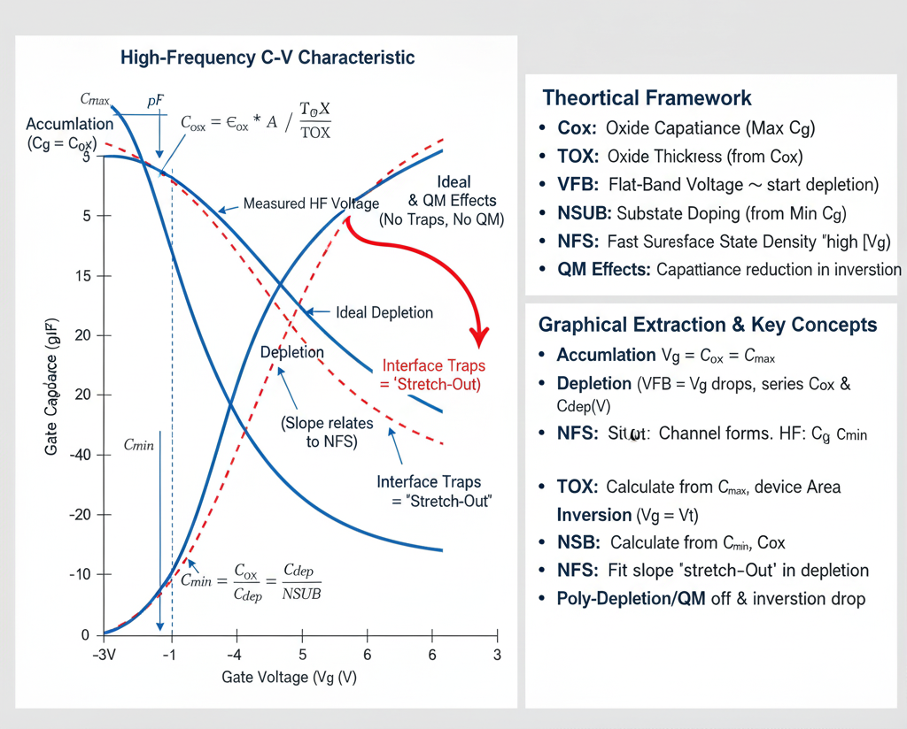

## Theory
**Introduction:**  
MOSFET C-V Parameter Extraction (Cg vs. Vg)

      
      
<strong>Fig. 1. MOSFET Cg vs Vg Capacitance-Voltage Characteristics & SPICE Parameter Extraction</strong>

## Introduction

The Gate Capacitance versus Gate Voltage (Cg vs. Vg) measurement is one of the most powerful methods for extracting a MOSFET's physical parameters. It involves measuring the capacitance of the MOS "stack" (Gate-Oxide-Substrate) as the gate voltage ($V_g$) is swept, while the source, drain, and bulk are typically grounded.

The C-V curve has three distinct regions, which are fundamental to understanding the device and its parameters:

1.  **Accumulation (Negative $V_g$ for NMOS):** The gate voltage attracts majority carriers (holes) to the silicon-oxide interface. The device acts like a simple parallel-plate capacitor, and the measured capacitance is at its maximum, $C_{max}$.
2.  **Depletion (Small Positive $V_g$ for NMOS):** The gate voltage pushes majority carriers away, leaving a "depletion region" of fixed ions. This depletion region has its own capacitance ($C_{dep}$) which acts *in series* with the oxide capacitance ($C_{ox}$). This causes the total capacitance to drop.
3.  **Inversion (High Positive $V_g$ for NMOS, $V_g > V_t$):** The gate voltage is strong enough to attract minority carriers (electrons), forming the inversion layer, or "channel."

### High-Frequency vs. Low-Frequency C-V

* **Low-Frequency (LF):** The AC signal is slow enough that the minority carriers in the channel *can respond*. The channel effectively acts as the bottom "plate" of the capacitor, and the capacitance returns to its maximum value, $C_{ox}$.
* **High-Frequency (HF):** (e.g., 1 MHz). The AC signal is *too fast* for the minority carriers to be generated and respond. The AC signal only "sees" the underlying depletion region, which is at its maximum width. Therefore, the capacitance *stays at its minimum value* ($C_{min}$).

**SPICE parameter extraction is almost always performed using the High-Frequency (HF) C-V curve.**

---

## 1. Oxide and Substrate Parameters (LEVEL 1, 2, 3)

### `TOX` (Oxide Thickness)

* **Theory:** The maximum capacitance ($C_{max}$) measured in the strong accumulation region is equal to the oxide capacitance ($C_{ox}$).
    $$C_{max} = C_{ox} = \frac{\epsilon_{ox} \cdot A}{TOX}$$
* **Extraction:**
    1.  Measure $C_{max}$ from the "high" plateau of the C-V curve.
    2.  Knowing the device area ($A$) and the permittivity of silicon dioxide ($\epsilon_{ox}$), **`TOX`** can be directly calculated.
    3.  This is the most important parameter, as `TOX` (or $C_{ox}$) is used in the equations for almost all other parameters (like `KP`, `GAMMA`, etc.).

### `NSUB` (Substrate Doping)

* **Theory:** The *minimum* capacitance ($C_{min}$) on the HF C-V plot occurs when the depletion region is at its maximum width ($W_{d,max}$). This minimum capacitance is $C_{ox}$ in series with the maximum depletion capacitance ($C_{dep,max}$).
    $$C_{min} = \frac{C_{ox} \cdot C_{dep,max}}{C_{ox} + C_{dep,max}}$$
    The maximum depletion width ($W_{d,max}$) is physically determined by the substrate doping concentration, **`NSUB`**.
* **Extraction:**
    1.  Measure $C_{min}$ from the "low" plateau of the C-V curve.
    2.  Using the $C_{ox}$ value found from $C_{max}$, solve the series-capacitor equation to find $C_{dep,max}$.
    3.  From $C_{dep,max}$, the underlying physical parameter **`NSUB`** can be calculated.

### `VFB` (Flat-Band Voltage)

* **Theory:** This is the gate voltage required to counteract the work-function differences and fixed oxide charges (`Qf`), resulting in "flat" energy bands in the silicon. It is the theoretical transition point between accumulation and depletion.
* **Extraction:** `VFB` is not a simple intercept. It is extracted by analyzing the "shoulder" of the C-V curve as it transitions from $C_{max}$ into depletion. Advanced calculation methods (like finding the inflection point or using a "flat-band capacitance" value) are used to pinpoint `VFB`.

---

## 2. Interface Effects (LEVEL 3)

### `NFS` (Fast Surface States / Interface Traps)

* **Theory:** Real Si/SiO2 interfaces have "traps" (defects) that can capture or release charge. As the gate voltage sweeps through depletion, these traps must be charged/discharged, which also consumes part of the AC signal.
* **Effect on Plot:** This "wastes" charge and makes the C-V curve "stretch out," meaning the slope in the depletion region becomes less steep than the ideal curve.
* **Extraction:** `NFS` is a fitting parameter. The *slope* of the measured C-V curve in the depletion region is compared to the *ideal* slope (calculated from `TOX` and `NSUB`). The amount of "stretch-out" is used to quantify and extract **`NFS`**.

---

## 3. Advanced Physical Effects (LEVEL 6 - BSIM)

For modern devices, two advanced effects (which are *not* modeled in LEVEL 1-3) must be accounted for.

### Polysilicon Gate Depletion

* **Theory:** The polysilicon gate is *not* a perfect metal. At high positive or negative gate voltages, a *depletion region forms in the polysilicon gate itself*. This poly-depletion layer has its own capacitance ($C_{poly}$) that is in series with $C_{ox}$.
* **Effect on Plot:** This causes a *roll-off* or *decrease* in the measured capacitance *in the strong accumulation and inversion (LF) regions*. The measured "maximum" capacitance is slightly lower than the true $C_{ox}$.
* **Extraction:** This is a *fitting parameter* in advanced models. The model is adjusted until it correctly fits this roll-off at high gate voltages.

### Quantum Mechanical (QM) Effects

* **Theory:** In strong inversion, the channel (inversion layer) is not a 2D sheet sitting perfectly at the Si/SiO2 interface. Quantum mechanics confines the electrons to a region *slightly away* from the interface.
* **Effect on Plot:** This physical separation acts like a small, extra capacitor ($C_{qm}$) in series with $C_{ox}$. This *lowers* the total measured capacitance in the inversion region, even on an LF plot.
* **Extraction:** This is another advanced *fitting parameter*. The model equations are adjusted until they match the measured capacitance reduction in the strong inversion region.

     
 
